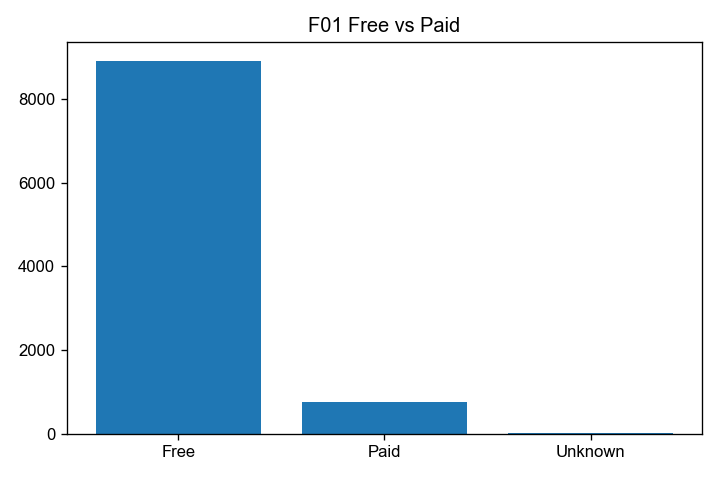
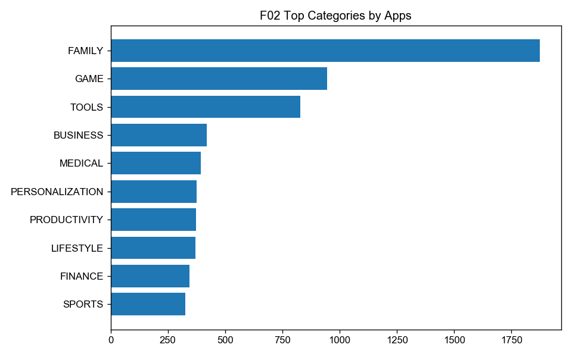
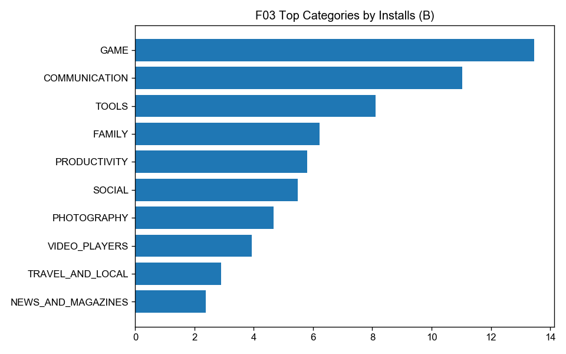
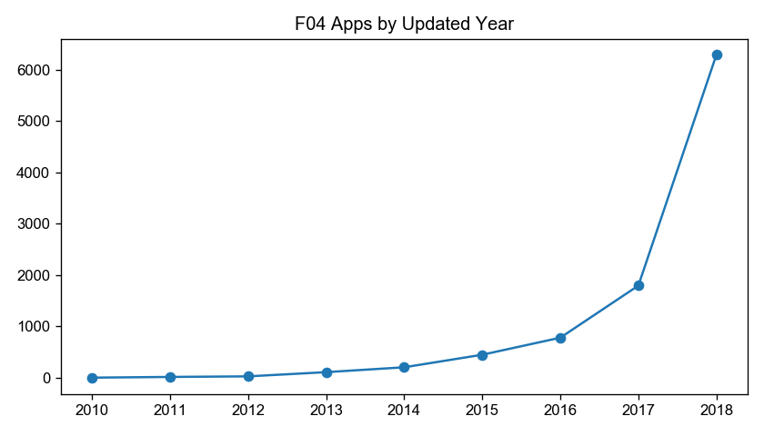
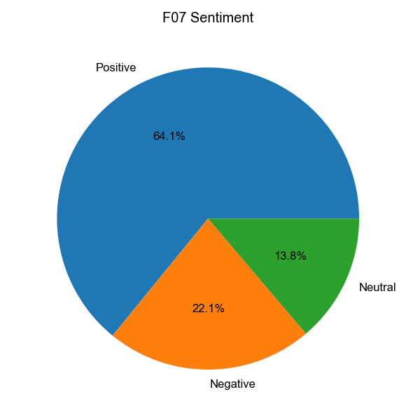

# 使用方法：安装 Skills 并用 Google Play 案例跑通全流程

本文面向学生/助教，说明安装本项目后，如何在 Cursor（或其它支持 Agent Skills 的工具）里**用 Skill 做数据分析**。

演示数据已放在仓库：

- `fixtures/googleplaystore.csv`（应用表，约 1.08 万行）
- `fixtures/googleplaystore_user_reviews.csv`（评论表，约 6.4 万行）

文中命令输出均在本机对上述 fixtures **实跑抓取**（2026-09-20）。精简结果与示例图见：

- `docs/examples/googleplay-demo/outputs/`
- `docs/examples/googleplay-demo/charts/`

---

## 0. 你需要先搞清的两件事

### Skill 是什么？

Skill 是给 AI 代理读的「标准作业程序」（`skills/*/SKILL.md`）。安装后，代理会在相关任务时自动选用，或你用 `/技能名` 显式调用。

Skill **本身不是** `npm run` 那种一键分析程序；真正算数、出图，由代理按 Skill 写代码/跑命令完成。本仓库额外提供 `scripts/*.mjs`，方便接收校验、画像、脚手架等可复现步骤。

### 推荐课堂路径

```text
安装 Skills → 打开本仓库 → 建本地交付目录（勿提交大数据结果）
  → 按阶段调用 Skill（或一句总控）
  → 需要时配合 scripts 做校验
  → 对照本文「实跑结果」验收
```

---

## 1. 环境准备

| 项 | 要求 |
|----|------|
| Node.js | ≥ 18（`node -v`） |
| 编辑器 | Cursor（推荐）或其它支持 Agent Skills 的客户端 |
| 本仓库 | 已 clone，或已 `npm i data-analysis-spec` 后从 GitHub 装 Skill |

```bash
node -v
# 示例：v23.5.0
```

进入仓库根目录：

```bash
cd /path/to/data-analysis-spec
```

---

## 2. 安装 Skills

### 方式 A：从 GitHub 安装（学生最常用）

```bash
# 安装本仓库全部 15 个 skills 到当前项目
npx skills add WangLaoShi/data-analysis-spec

# 或只装总控
npx skills add WangLaoShi/data-analysis-spec --skill data-analysis

# 装到用户全局（所有项目可用）
npx skills add WangLaoShi/data-analysis-spec -g
```

按提示选择代理（Cursor / Claude Code 等）。Cursor 项目级一般落在 `.agents/skills/` 或 `.cursor/skills/`。

### 方式 B：本仓库本地联调

```bash
npx skills add . --list
npx skills add . -y
```

### 实跑：本地可发现的 Skills（抓取）

```bash
npx skills add . --list
```

关键输出：

```text
◇  Found 15 skills

◇  Available Skills
│    actionable-recommendations
│    analysis-decomposition
│    analysis-report
│    data-analysis
│    data-cleaning
│    data-intake
│    data-structuring
│    data-visualization
│    delivery-archive
│    derived-metrics
│    exploratory-data-analysis
│    insight-conclusion
│    metrics-calculation
│    multidimensional-analysis
│    statistical-analysis
```

工程自检：

```bash
npm run validate:skills
```

实跑摘要：`15 skills, 0 problems`。

---

## 3. 在 Cursor 里怎么「用」Skill

1. 用 Cursor 打开本仓库（或已安装 skills 的课程项目）。
2. 打开 Agent 对话。
3. 任选一种调用方式：

| 方式 | 例子 |
|------|------|
| 斜杠命令 | `/data-intake`、`/data-cleaning`、`/data-analysis` |
| 自然语言 | 「按规范接收 fixtures 里的 Google Play 数据」 |

4. **把数据路径说清楚**（课堂固定用 fixtures）：

```text
数据文件：
- fixtures/googleplaystore.csv
- fixtures/googleplaystore_user_reviews.csv

交付目录请写到 /tmp/da-class-demo/deliverables（不要写进 git）
```

5. 每一阶段结束后，让代理勾选该 Skill 的 DoD，再进入下一阶段。

---

## 4. 课堂交付目录（先建好）

```bash
npm run scaffold -- --out /tmp/da-class-demo/deliverables --date 20260920 --force
```

实跑输出（节选）：

```json
{
  "ok": true,
  "root": "/tmp/da-class-demo/deliverables",
  "dirs": [
    "00_raw",
    "01_structured",
    "02_cleaned",
    "03_metrics",
    "04_charts",
    "05_report",
    "06_dictionary_and_logs",
    "README.md"
  ]
}
```

对应规范中的交付树。**分析过程与大数据结果不要 commit。**

---

## 5. 全流程 Skill 操作手册（含实跑）

下面按推荐顺序。每个 Skill 给出：触发话术、可选手动脚本、本机实跑结果。

---

### 5.0 总控 `data-analysis`（可选：一句话开跑）

**何时用：** 整题从头到尾；考试/作业要求「按规范完整交付」。

**对学生说：**

```text
/data-analysis

请按 data-analysis-spec 全流程分析 Google Play：
- fixtures/googleplaystore.csv
- fixtures/googleplaystore_user_reviews.csv
交付到 /tmp/da-class-demo/deliverables，不要修改仓库内 fixtures。
```

总控会按序调度：接收 → 结构化 → 清洗 → … → 归档。

课堂更建议**分 Skill 讲**，便于对照检查点。

---

### 5.1 `data-intake` — 数据接收与校验

**对学生说：**

```text
/data-intake
请接收 fixtures/googleplaystore.csv 与 googleplaystore_user_reviews.csv，
备份到 /tmp/da-class-demo/deliverables/00_raw，并做完整性校验。
```

**配套脚本（教师机/助教演示）：**

```bash
npm run backup -- --file ./fixtures/googleplaystore.csv \
  --out-dir /tmp/da-class-demo/deliverables/00_raw --source apps --date 20260920

npm run intake -- --file ./fixtures/googleplaystore.csv \
  --required-fields App,Category,Rating,Reviews,Installs \
  --date-field "Last Updated"
```

**实跑：`intake` 应用表（完整 JSON 见 `docs/examples/googleplay-demo/outputs/intake-apps.json`）**

```json
{
  "ok": true,
  "verdict": "pass",
  "blocking": [],
  "warnings": [],
  "meta": {
    "headerCount": 13,
    "dataRows": 10841,
    "encodingNote": "utf8",
    "sha256": "3e438f48161961933d26e99a8d9fc8ed79edfaa9fb34f8838e1ab4ec7a9fab91"
  },
  "columns": [
    "App", "Category", "Rating", "Reviews", "Size", "Installs",
    "Type", "Price", "Content Rating", "Genres",
    "Last Updated", "Current Ver", "Android Ver"
  ],
  "dateCoverage": {
    "min": "2010-05-20",
    "max": "2018-08-07",
    "parsedRows": 10840
  }
}
```

评论表 intake（实跑）：`dataRows: 64295`，字段 `App, Translated_Review, Sentiment, Sentiment_Polarity, Sentiment_Subjectivity`，`verdict: pass`。

**本阶段 DoD：** 备份存在、台账可填、校验通过或阻断项已记录。

---

### 5.2 `data-structuring` — 结构化规整

**对学生说：**

```text
/data-structuring
请整理两张表：统一列名、解析 Installs/Price/Size/日期类型，
输出字段映射表到 01_structured/，原始 fixtures 只读。
```

**实跑要点（代理应产出类似结论）：**

| 原字段 | 建议标准名 | 处理 |
|--------|------------|------|
| Installs | Installs_Num | 去 `+`、去千分位 |
| Price | Price_USD | 去 `$` |
| Size | Size_MB | `M`/`k` 换算；`Varies with device`→缺失 |
| Last Updated | Last_Updated | 解析为日期 |
| Rating | Rating_Num | 数值；后续清洗限制在 1–5 |

模板：`docs/templates/02-field-mapping.md`。

---

### 5.3 `data-cleaning` — 清洗

**对学生说：**

```text
/data-cleaning
按规范清洗 Google Play：处理非法 Rating、App 重复、评论情感缺失。
写清洗日志；异常行隔离，不要静默删。
```

**配套脚本：**

```bash
npm run profile -- --file ./fixtures/googleplaystore.csv --keys App --out /tmp/profile-apps.json
npm run cleaning-log -- --profile /tmp/profile-apps.json \
  --critical-fields App,Category \
  --out /tmp/da-class-demo/deliverables/02_cleaned/03-cleaning-log-apps.md
```

**实跑：`profile` 关键发现（见 `docs/examples/googleplay-demo/outputs/profile-apps.json`）**

```json
{
  "profiledRows": 10841,
  "duplicates": {
    "keyFields": ["App"],
    "uniqueKeys": 9660,
    "duplicateGroups": 798,
    "duplicateRows": 1979,
    "duplicateRowRate": 0.182548
  },
  "numeric": [
    {
      "field": "Rating",
      "min": 1,
      "median": 4.3,
      "max": 19,
      "nonNumeric": 1474
    }
  ]
}
```

教学点：`Rating` 最大值 **19** 为脏数据；`App` 重复约 **18.3%** 行。

**实跑：清洗后规模（本机全流程）**

| 项 | 数值 |
|----|------|
| 异常评分隔离 | 1 行 |
| 去重后应用数 | 9,659 |
| 评论原始行 | 64,295 |
| 有效情感评论 | 37,432 |

---

### 5.4 `derived-metrics` — 衍生字段

**对学生说：**

```text
/derived-metrics
在清洗后的应用表上生成：Year/Month、Install_Tier（头腰尾）、
Is_Paid，并按 App 汇总评论极性与正面占比。
```

**实跑衍生示例：**

- `Install_Tier`：`尾部(<1k)` … `超头(>10M)`
- 应用级 `polarity_mean` / `pos_rate`（左连接评论汇总）
- 有评测样本的应用：**816** 个（远小于 9,659 → 后面情感结论不可外推全站）

---

### 5.5 `analysis-decomposition` — 分析目标拆解

**对学生说：**

```text
/analysis-decomposition
针对 Google Play 专题，按四向输出分析提纲：大盘、结构、趋势异动、分层对比。
```

**实跑提纲摘要（课堂可用）：**

1. **大盘：** 应用数、免费占比、均分/中位、安装量结构  
2. **结构：** 品类应用数 Top、品类安装量贡献、内容分级  
3. **趋势：** 按 `Last Updated` 年份的应用数（注意：这是更新时间，不是上架流水）  
4. **分层：** 安装量分层 vs 评分；有评测 vs 无评测；评分 vs 评论极性  

模板：`docs/templates/04-analysis-outline.md`。

---

### 5.6 `metrics-calculation` — 核心指标

**对学生说：**

```text
/metrics-calculation
计算总量/质量/结构指标，写口径字典与底稿，数字要能回溯到清洗表。
```

**实跑指标（`docs/examples/googleplay-demo/outputs/metrics-summary.json`）**

```json
{
  "n_apps": 9659,
  "free_n": 8904,
  "paid_n": 754,
  "free_share": 0.9218,
  "avg_rating": 4.173,
  "med_rating": 4.3,
  "rated_coverage": 0.8485,
  "free_install_share": 0.9992,
  "head20_install_share": 0.7271,
  "pareto_apps": 421,
  "pareto_share": 0.0436,
  "pos_rate": 0.6411,
  "neg_rate": 0.2210,
  "neu_rate": 0.1379,
  "corr": 0.2679,
  "top_cat_apps": "FAMILY",
  "top_cat_install": "GAME",
  "year_min": "2010-05-21",
  "year_max": "2018-08-08"
}
```

口径说明（课堂板书）：

| 指标 | 口径要点 |
|------|----------|
| 安装量 | `Installs` 为分档近似（如 `10,000+`），合计是**下界估计** |
| 帕累托 | 按安装量降序，累计达 80% 的应用个数 / 总应用数 |
| 品类头部 20% | 安装量最高的约 20% 品类合计 / 总安装量 |
| 情感占比 | 仅 `Sentiment ∈ {Positive,Neutral,Negative}` 的评论 |

---

### 5.7 `multidimensional-analysis` — 多维分析

**对学生说：**

```text
/multidimensional-analysis
请覆盖趋势、结构、对比、相关、二八、异常归因六个视角，先排除数据质量问题再谈业务。
```

**实跑六视角结论（摘要）：**

| 视角 | 实跑发现 |
|------|----------|
| 趋势 | 按更新年，应用数向 2017–2018 集中（快照字段偏差） |
| 结构 | 免费主导；供给最多品类 FAMILY，安装最多品类 GAME |
| 对比 | 免费 vs 付费数量差一个数量级；安装几乎全在免费侧 |
| 相关 | 评分与评论极性 r≈0.27（有评测样本子集） |
| 二八 | 约 **4.4%** 应用贡献 80% 安装；品类头部约 20% 贡献约 **72.7%** 安装 |
| 异常归因 | Rating=19 等为**数据质量**；情感大量无效为字段质量，不是「业务突然变差」 |

补充 Skill（可选）：

- `/exploratory-data-analysis`：更自由的探索  
- `/statistical-analysis`：若要做显著性/回归，须先说明样本与假设  

---

### 5.8 `data-visualization` — 可视化

**对学生说：**

```text
/data-visualization
按规范出图：免费付费对比、品类 Top、更新年趋势、情感结构；每图含标题与口径说明。
```

**实跑示例图（已入库供对照）：**

| 图 | 文件 |
|----|------|
| F01 免费/付费应用数 |  |
| F02 品类应用数 Top10 |  |
| F03 品类安装量 Top10 |  |
| F04 按更新年份应用数 |  |
| F07 评论情感结构 |  |

---

### 5.9 `insight-conclusion` — 结论

**对学生说：**

```text
/insight-conclusion
用「现象+对比+支撑+解读」写出现状/亮点/问题三类结论，禁止无数据臆断。
```

**实跑结论示例：**

**现状 C-S01**  
现象：商店以免费应用为主。  
对比：免费 8,904 vs 付费 754（约 92.2%）。  
支撑：指标表；F01。  
解读：分发与获客仍由免费 + 广告/内购主导。

**亮点 C-H01**  
现象：安装量高度集中。  
对比：约 4.4% 应用贡献 80% 安装；品类头部约 20% 贡献约 72.7% 安装；安装第一品类 GAME。  
支撑：帕累托指标；F03。  
解读：运营应抓住头部品类，腰部需差异化。

**问题 C-P02**  
现象：原始数据有脏评分与 App 重复。  
对比：隔离非法 Rating 1 行；去重前重复行约 18%。  
支撑：profile 输出；清洗日志。  
解读：不清洗会扭曲排行与均分。

---

### 5.10 `actionable-recommendations` — 建议

**对学生说：**

```text
/actionable-recommendations
针对问题结论给出可落地、可量化建议，禁止「加强运营」类空话。
```

**实跑建议示例：**

| ID | 对应问题 | 动作 | 预期量化 |
|----|----------|------|----------|
| R01 | C-P02 | ETL 固化 Rating∈[1,5] 与 App 去重，保留隔离表 | 非法评分→0；App 键唯一 |
| R02 | 高安装≠高体验 | 超头应用增加差评/崩溃监控，不唯安装量 KPI | 超头负向情感率相对下降 10% |
| R03 | 评测覆盖仅 816 App | 报告中强制「有评测/无评测」分层，禁止全站外推情感 | 覆盖说明写入报告数据说明章 |

---

### 5.11 `analysis-report` — 分析报告

**对学生说：**

```text
/analysis-report
按九章结构写完整报告，数字与图表、口径、清洗日志一致。
```

结构检查清单：摘要 → 数据说明 → 大盘 → 分维 → 归因 → 亮点 → 策略 → 风险 → 附录。

模板：`docs/templates/09-report-outline.md`。

---

### 5.12 `delivery-archive` — 归档验收

**对学生说：**

```text
/delivery-archive
按交付清单核对 /tmp/da-class-demo/deliverables，勾选 AC-01～AC-07。
```

**配套脚本：**

```bash
npm run validate:delivery -- --dir /tmp/da-class-demo/deliverables
npm run validate:delivery -- --dir /tmp/da-class-demo/deliverables --strict
```

`strict` 要求 raw / cleaned / metrics / charts / report 等槽位均有匹配文件。

---

## 6. 一条龙课堂口令（复制即用）

把下面整段贴进 Cursor Agent：

```text
你现在按 data-analysis-spec 的 Skills 执行 Google Play 专题分析。

数据（只读）：
- fixtures/googleplaystore.csv
- fixtures/googleplaystore_user_reviews.csv

交付根目录：/tmp/da-class-demo/deliverables
禁止把清洗结果、图表、报告提交进 git。

请严格按顺序调用并产出对应模板文件：
1) data-intake
2) data-structuring
3) data-cleaning（含清洗日志与隔离表）
4) derived-metrics
5) analysis-decomposition
6) metrics-calculation
7) multidimensional-analysis
8) data-visualization
9) insight-conclusion
10) actionable-recommendations
11) analysis-report
12) delivery-archive

每阶段结束列出 DoD 勾选与文件路径。最后对照 docs/examples/googleplay-demo/outputs/metrics-summary.json 核对关键数字数量级是否一致。
```

---

## 7. Skill 与脚本对照表

| Skill | 规范章节 | 常用触发语 | 可选脚本 |
|-------|----------|------------|----------|
| `data-analysis` | 全文 | 按规范做完整分析 | `scaffold` / `validate:*` |
| `data-intake` | 5.1 | 接收/备份/校验 | `backup` `intake` |
| `data-structuring` | 5.2 | 整理表头/类型 | — |
| `data-cleaning` | 5.3 | 清洗/去重/异常 | `profile` `cleaning-log` |
| `derived-metrics` | 5.4 | 衍生字段/分层 | — |
| `analysis-decomposition` | 5.5 | 分析提纲 | — |
| `metrics-calculation` | 5.6 | 算指标/口径 | `check:metrics` |
| `multidimensional-analysis` | 5.7 | 多维/二八/归因 | — |
| `exploratory-data-analysis` | 补充 | 做 EDA | `profile` |
| `statistical-analysis` | 补充 | 显著性/回归 | — |
| `data-visualization` | 5.8 | 出图 | — |
| `insight-conclusion` | 5.9 | 写结论 | — |
| `actionable-recommendations` | 5.10 | 给建议 | — |
| `analysis-report` | 5.11 | 写报告 | — |
| `delivery-archive` | 5.12 | 归档验收 | `validate:delivery` |

脚本详解：`scripts/README.md`。

---

## 8. 常见问题

**Q：只装了 Skill，不跑 scripts 可以吗？**  
可以。Skill 指导代理完成分析；scripts 用于标准化校验与课堂统一口径演示。

**Q：为什么情感结论不能代表全商店？**  
实跑仅 816 个应用有评测样本，而清洗后应用 9,659 个。

**Q：Installs 能当精确流水吗？**  
不能。字段是分档字符串，解析后是下界估计。

**Q：大文件要不要提交？**  
`fixtures/` 中的演示 CSV 可随仓库分发；**学生作业交付包**应放 `/tmp` 或课程指定目录，不要把清洗结果推到 git。

---

## 9. 验收清单（给学生）

- [ ] 已 `npx skills add` 且能列出本项目 skills  
- [ ] 会用 `/data-intake` … `/delivery-archive` 或等价自然语言  
- [ ] 交付目录符合 `00_raw` … `06_dictionary_and_logs`  
- [ ] 清洗日志记录了 Rating 异常与 App 去重  
- [ ] 指标含口径；图表有标题与来源  
- [ ] 结论四要素齐全；建议可量化  
- [ ] 关键数字与 `docs/examples/googleplay-demo/outputs/metrics-summary.json` 数量级一致  

---

## 10. 本文实跑环境备忘

| 项 | 值 |
|----|-----|
| 包版本 | data-analysis-spec@0.3.2（以本仓库为准） |
| 数据 | `fixtures/googleplaystore*.csv` |
| 抓取日期 | 2026-09-20 |
| 结果摘要 | `docs/examples/googleplay-demo/outputs/metrics-summary.json` |
